## Table Of Contents

- [Hospital Management](#hospital-management)
  - [Table Of Contents](#table-of-contents)
  - [About The Project](#about-the-project)
  - [Built With](#built-with)
  - [Getting Started](#getting-started)
    - [Prerequisites](#prerequisites)
    - [Installation](#installation)
  - [Usage](#usage)
  - [Live Demo](#live-demo)
  - [Conception](#conception)
  - [Screenshots](#screenshots)
  - [Seed Database](#seed-database)

## About The Project

The Hospital Management Django project is designed to streamline the interaction between doctors and patients. Doctors have the capability to upload blogs or save them as drafts, allowing them to share valuable medical information and insights. Additionally, the system enables doctors to manage appointments by checking, accepting, or canceling them. This ensures efficient scheduling and communication between healthcare providers and patients.

For patients, the project offers a user-friendly interface for registration and login. Once logged in, patients can access the blog section to read and comment on doctors' posts. The appointment booking feature allows patients to choose a specific doctor based on filters and schedule appointments. Patients can also view their past appointments, creating a comprehensive and accessible record of their medical history. Overall, this Hospital Management system enhances communication and accessibility in the healthcare process for both doctors and patients.

## Built With

**FRONT-END :**
- HTML
- CSS 
 - JS
- Bootstrap
- jQuery

**BACK-END :**
 - Python
- Django
- SQLite

## Getting Started

To get started with the Hospital Management System, follow the instructions below.

### Prerequisites

Make sure you have the following prerequisites installed on your machine:

- Python

### Installation

1. Clone the repository to your local machine:

```bash
   git clone https://github.com/hamzaezzine/Hospital-Management  
```

2. Create virtual environmenet  :  
```bash
   virtualenv env
   or  
   python -m venv env
```
then start the environmenet :  
```bash
  env\Scripts\activate
```

3. Navigate to the project directory:
```bash 
cd Hospital-Management
```

5. Install the required dependencies:
```bash
pip install -r requirements.txt
```

7. Apply migrations to set up the database:
```bash 
python manage.py migrate
```

## Usage

1. Start the development server:  
```bash
python manage.py runserver
```

3. Open your web browser and visit http://localhost:8000 to access the Hospital Management System.

4. Follow the on-screen instructions to register/login as a doctor or patient.

5. Explore the features, including blog management, appointment scheduling, and more.

## Live Demo
Check Website Online here : [Hospital Management](https://hamzaezzine.pythonanywhere.com/)


## Conception
1. Database Schema
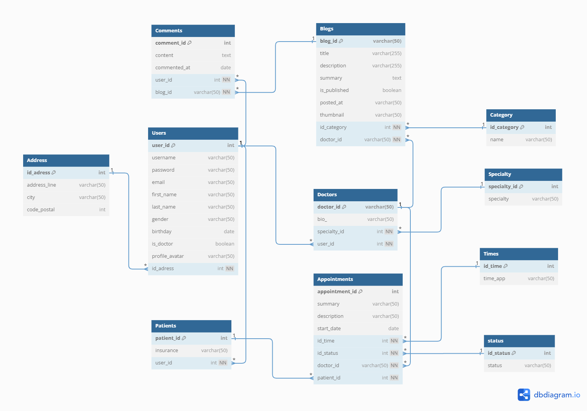

2. Use Case Diagram : 
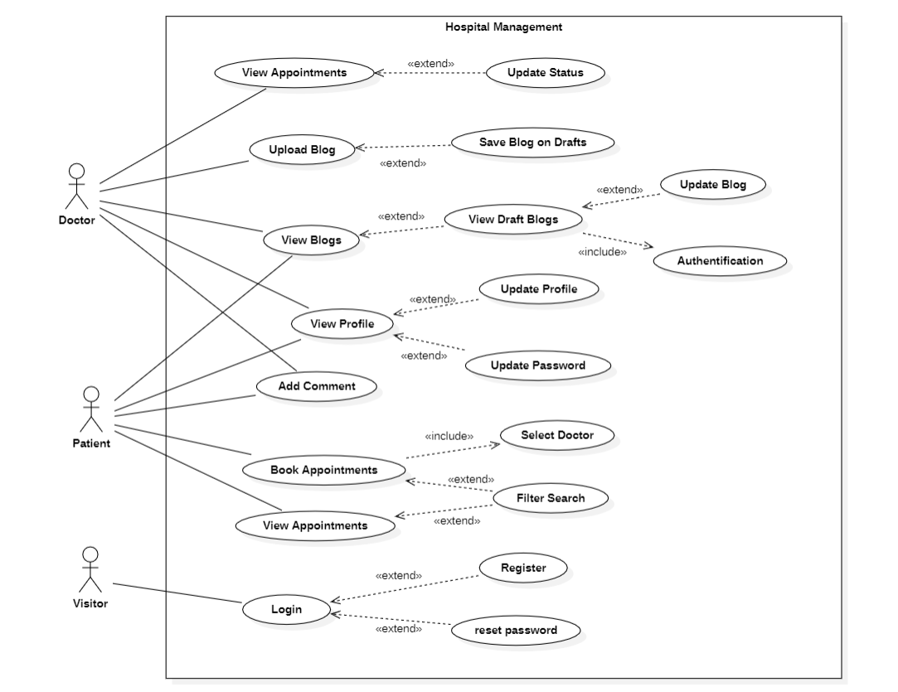

## Screenshots
- Login Page : 
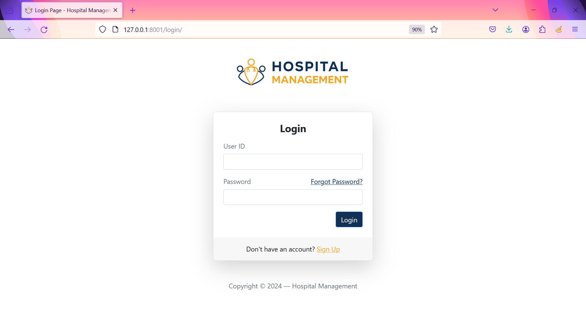

- Register Page : 
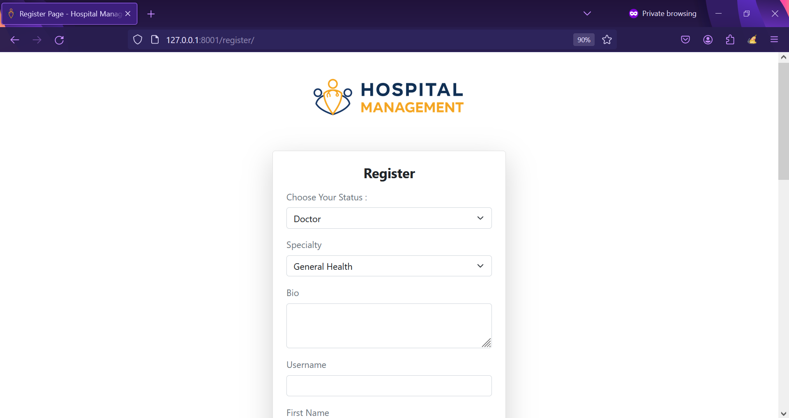

- Profile Page : 
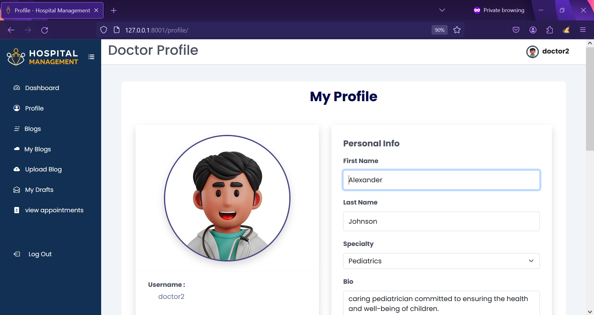

- Blogs : 
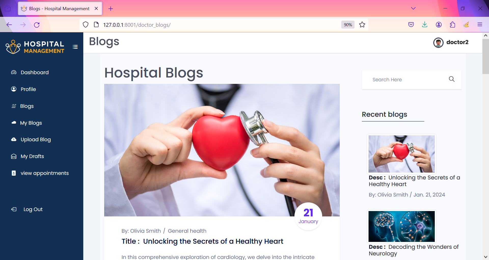

- Upload Blog Page : 
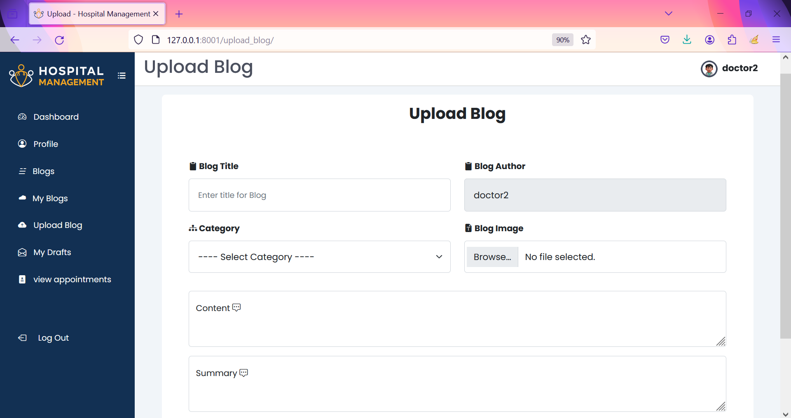

- Draft Blogs Page : 
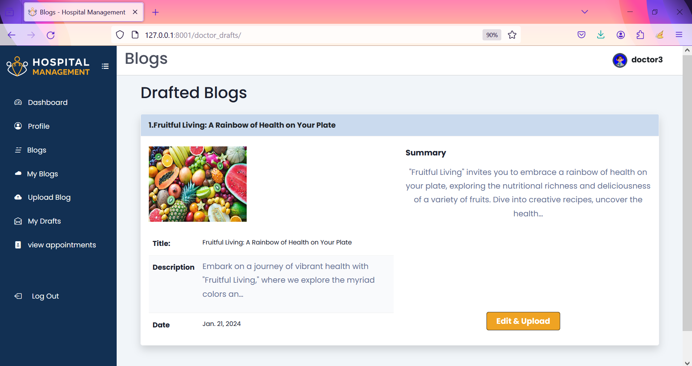

- Doctor Appointments Page : 
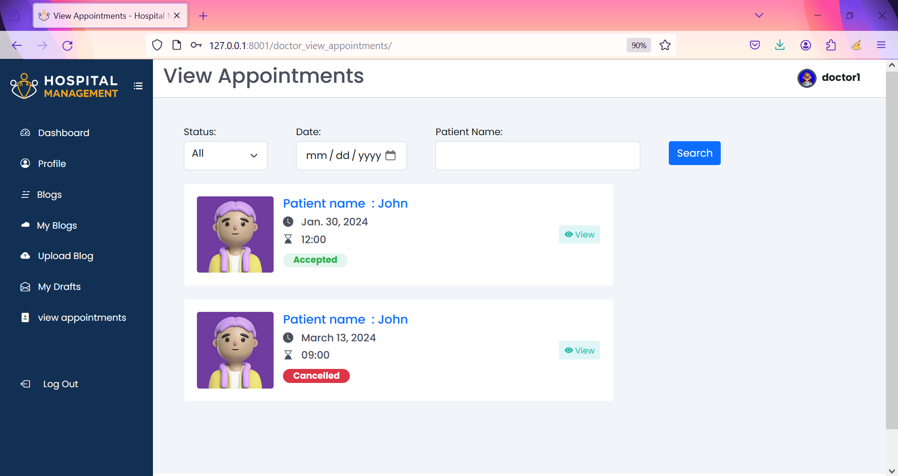

- Patient Book Appointments Page : 


- Patient Confirm Appointments Page : 
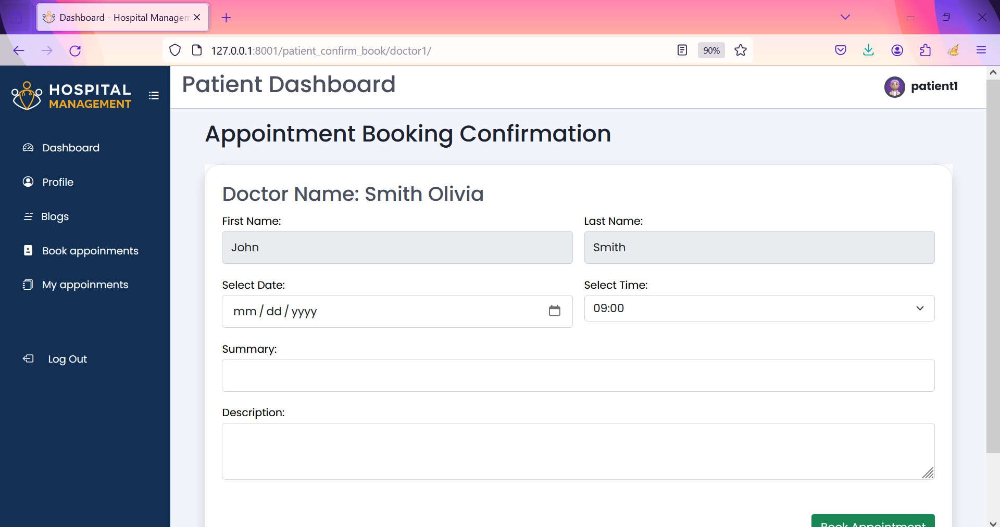

- Patient View Appointments Page : 
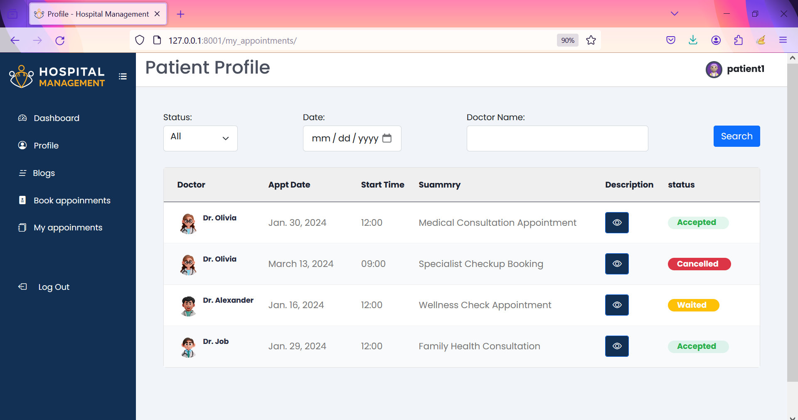


## Seed Database
```bash
python manage.py loaddata seed/categories.json 
python manage.py loaddata seed/specialities.json
python manage.py loaddata seed/status.json
python manage.py loaddata seed/time.json
```
